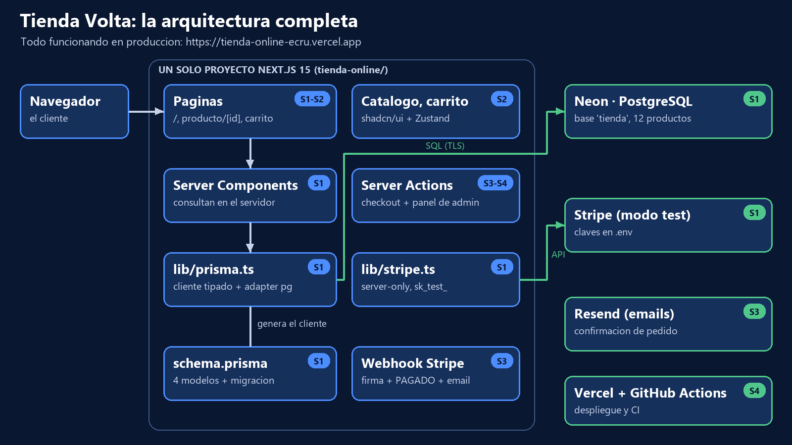

# Tienda Volta · tienda online con Next.js, Stripe y Neon

Tienda online completa, de punta a punta: catalogo con busqueda y filtros, carrito persistente, pago con
Stripe confirmado por **webhook**, email de confirmacion y panel de administracion. Desplegada en Vercel con CI.

**Demo en produccion:** https://tienda-online-ecru.vercel.app (Stripe en modo test: usa la tarjeta `4242 4242 4242 4242`,
cualquier fecha futura y cualquier CVC; no se cobra nada)

> Proyecto Ecommerce del Master Desarrollo Agentico (The Power), construido en 4 sesiones.



## Que hace

- **Catalogo** con busqueda por nombre, filtros por categoria y precio resueltos en el servidor (la URL es compartible).
- **Pagina de producto** con ruta dinamica, stock y 404.
- **Carrito** con Zustand que sobrevive a recargar y a cerrar el navegador (localStorage).
- **Checkout** con Stripe desde una Server Action: los precios se releen de la base de datos, nunca del navegador.
- **Webhook firmado**: el unico punto que marca un pedido como PAGADO, descuenta stock y envia el email (idempotente).
- **Email de confirmacion** con Resend.
- **Panel de admin** protegido: pedidos por estado y cambios de estado (pagado -> enviado -> entregado).

## Stack

| Capa | Tecnologia |
|---|---|
| Framework | Next.js 15 (App Router, Server Components, Server Actions) + TypeScript |
| UI | Tailwind CSS 4 + shadcn/ui (Base UI) |
| Estado del carrito | Zustand 5 + persist |
| Base de datos | PostgreSQL en Neon + Prisma 7 (driver adapter pg) |
| Pagos | Stripe Checkout + webhooks (modo test) |
| Emails | Resend |
| Calidad | ESLint, TypeScript estricto, Vitest, GitHub Actions |
| Despliegue | Vercel (deploy automatico en cada push a main) |

## Decisiones de diseno

1. **Precios en centimos** (enteros) en la base de datos y en Stripe: sin errores de coma flotante.
2. **El pedido se confirma en el webhook, no en la pagina de exito**: si el cliente cierra el navegador tras pagar, el
   pedido se confirma igual. La pagina de exito solo lee y cuenta el estado.
3. **Nada que venga del navegador es fiable**: el checkout recibe ids y cantidades y recalcula precios y stock.
4. **Idempotencia**: el webhook solo cambia pedidos en PENDIENTE; un evento repetido no descuenta stock dos veces.
5. **Secretos solo en el servidor**: `server-only` en `lib/stripe.ts` y `lib/email.ts`; cada Server Action del admin
   vuelve a comprobar la sesion (el middleware protege paginas, no acciones).

## Ejecutarlo en local

Necesitas Node.js 20+, una base PostgreSQL (Neon free tier o `docker compose up -d`), una cuenta de Stripe en modo test,
la [Stripe CLI](https://github.com/stripe/stripe-cli) y una cuenta de Resend.

```bash
npm install                 # dependencias + cliente de Prisma
cp .env.example .env        # y rellena los valores
npx prisma migrate deploy   # crea las tablas
npm run seed                # 4 categorias y 12 productos
npm run dev                 # http://localhost:3000
# en otra terminal: reenviar los eventos de Stripe al webhook local
stripe listen --events checkout.session.completed --forward-to localhost:3000/api/webhooks/stripe
```

Comprobaciones utiles: `npm run db:check`, `npm run stripe:check`, `npx tsx scripts/ver-pedidos.ts`, `npm test`.

## Desplegarlo en Vercel

1. Importa el repositorio en Vercel (Next.js se detecta solo; `postinstall` genera el cliente de Prisma).
2. Variables de entorno: `DATABASE_URL`, `DIRECT_URL`, `STRIPE_SECRET_KEY`, `NEXT_PUBLIC_STRIPE_PUBLISHABLE_KEY`,
   `RESEND_API_KEY`, `EMAIL_PRUEBAS`, `ADMIN_PASSWORD`.
3. En Stripe (Workbench > Webhooks > Add destination): evento `checkout.session.completed` y URL
   `https://TU-DOMINIO/api/webhooks/stripe`. Copia su signing secret como `STRIPE_WEBHOOK_SECRET` en Vercel y redespliega.
4. Usa el dominio de produccion (`*.vercel.app` sin hash): las URLs de cada despliegue estan protegidas por Vercel.

## Estructura

```
src/app/                 paginas: catalogo, producto/[id], carrito, checkout (exito/cancelado), admin
src/app/checkout/        Server Action del checkout
src/app/api/webhooks/    webhook de Stripe (la unica API route)
src/components/          cabecera, tarjetas, filtros, carrito, admin (y ui/ de shadcn)
src/lib/                 prisma, stripe, email, catalogo, estados, admin, formato
src/store/carrito.ts     carrito con Zustand + persist
prisma/                  schema, migraciones y seed
tests/                   tests de reglas de negocio (Vitest)
.github/workflows/ci.yml lint + tipos + tests + build en cada push
```

Material de clase: tienda ficticia, pagos en modo test. Los prompts usados para construirla estan en `PROMPTS.md`.
